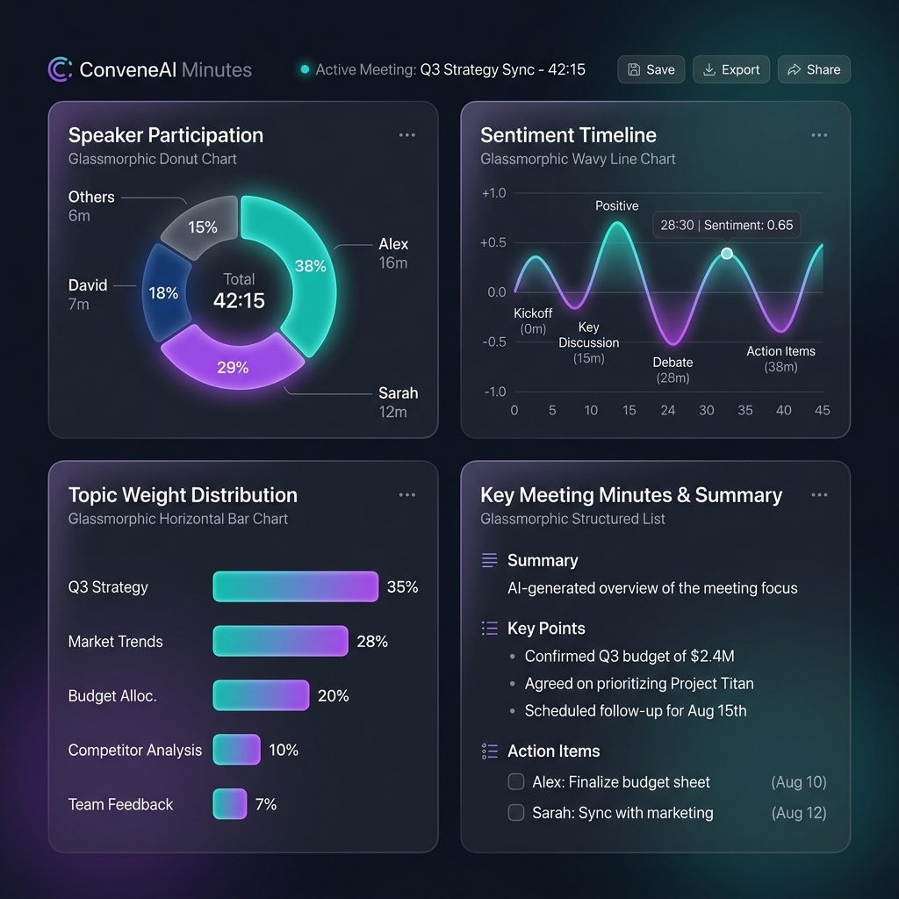
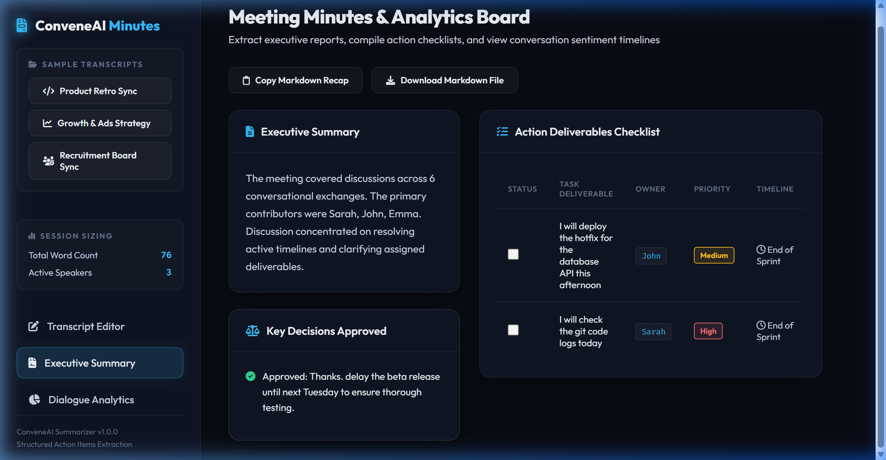
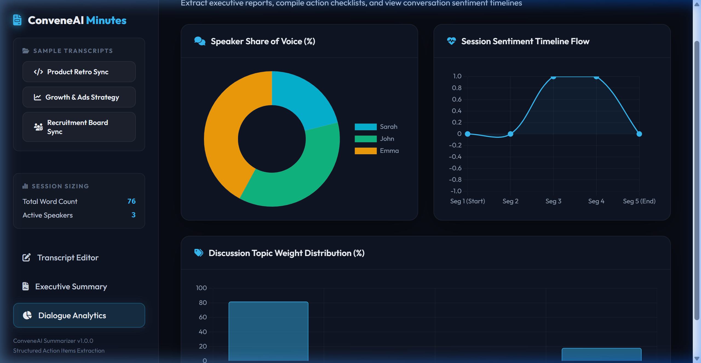
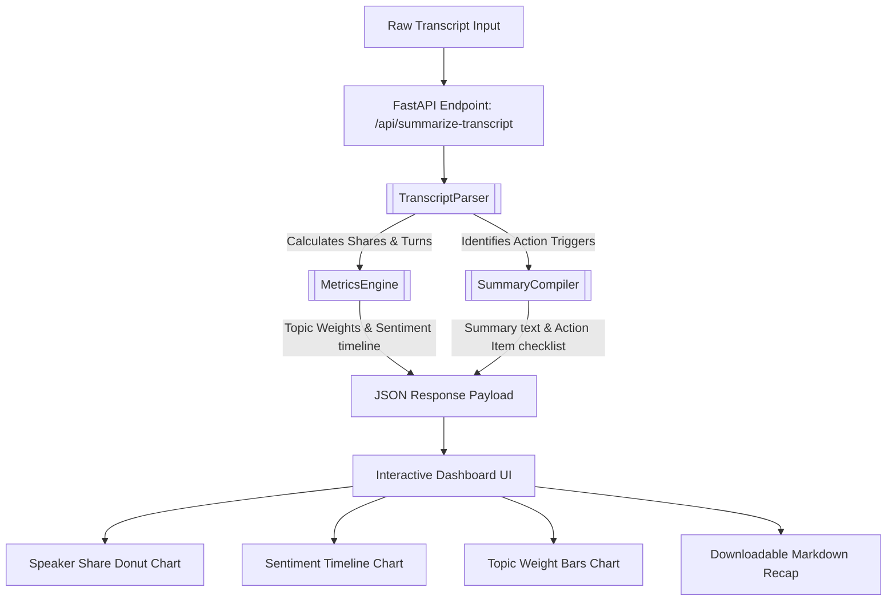

# ⚡ ConveneAI Minutes — Meeting Summarizer & Analytics Board

Welcome to **ConveneAI Minutes**, a glassmorphic meeting intelligence workstation designed to parse transcripts, analyze conversational stats, and compile premium summaries. It features an interactive action item deliverables checklist, speaker word share counters, topic weight bars, and dialogue sentiment flow charts.

---

## 🎨 Visual Preview

Here is a visual overview of the glassmorphic dashboard interface and its analytic panels:

### 🌟 Premium Interface Mockup


### 📊 Real Application Views
| Executive Summary & Actions | Dialogue Analytics & Sentiment |
|:---:|:---:|
|  |  |

---

## 🏗️ Architecture & Data Flow

Below is the conceptual processing pipeline. The application parses raw meeting text, processes it using specialized backend modules, and serves it through a FastAPI web server.



---

## ⚙️ Core Engines & Code Structure

The workspace is composed of the following files and directories:

*   [main.py](file:///c:/Users/ftria/Documents/Workspaces/FIRMAN/Project/Github/ai-meeting-summarizer/main.py): Sets up the FastAPI application, mounts the static frontend folder, handles CORS, and exposes the preset and summarization endpoints.
*   [utils/summarizer_engine.py](file:///c:/Users/ftria/Documents/Workspaces/FIRMAN/Project/Github/ai-meeting-summarizer/utils/summarizer_engine.py): Houses the primary logic engines:
    *   [TranscriptParser](file:///c:/Users/ftria/Documents/Workspaces/FIRMAN/Project/Github/ai-meeting-summarizer/utils/summarizer_engine.py#L4): Parses text speaker prefixes (e.g. `Sarah: ` or `[John]: `) and compiles word statistics.
    *   [MetricsEngine](file:///c:/Users/ftria/Documents/Workspaces/FIRMAN/Project/Github/ai-meeting-summarizer/utils/summarizer_engine.py#L53): Performs local sentiment valence scoring and keyword topic weighting.
    *   [SummaryCompiler](file:///c:/Users/ftria/Documents/Workspaces/FIRMAN/Project/Github/ai-meeting-summarizer/utils/summarizer_engine.py#L117): Scans sentences for action deliverables, owners, deadlines, and key decisions.
*   [static/](file:///c:/Users/ftria/Documents/Workspaces/FIRMAN/Project/Github/ai-meeting-summarizer/static): Front-end assets served directly to the browser:
    *   [index.html](file:///c:/Users/ftria/Documents/Workspaces/FIRMAN/Project/Github/ai-meeting-summarizer/static/index.html): HTML5 layout containing the dashboard grid.
    *   [styles.css](file:///c:/Users/ftria/Documents/Workspaces/FIRMAN/Project/Github/ai-meeting-summarizer/static/styles.css): Glassmorphic styling utilizing gradients, blur filters, and micro-animations.
    *   [app.js](file:///c:/Users/ftria/Documents/Workspaces/FIRMAN/Project/Github/ai-meeting-summarizer/static/app.js): Handles form submission, sidebar tabs, preset loading, and initializes Chart.js instances.
*   [verify_summarizer.py](file:///c:/Users/ftria/Documents/Workspaces/FIRMAN/Project/Github/ai-meeting-summarizer/verify_summarizer.py): Programmatic test suite auditing dialogue parsing, speaker calculations, topics, sentiment valence, and action checklists.

---

## 📈 Metric Details & Extraction Logic

The table below describes how raw meeting transcripts are mapped to metrics by the summarization engines:

| Metric Name | Calculation Method | Keywords / Rules | Dashboard UI Visualization |
| :--- | :--- | :--- | :--- |
| **Speaker share** | Word percentage count of speaker's dialogue lines | `Words in Speaker turns / Total Words` | Chart.js Donut chart |
| **Topic Weight** | Keyword occurrence count density | Tech: `api`, `code`, `deploy`, `git`<br>Marketing: `seo`, `ads`, `growth`<br>Finance: `budget`, `invoice`, `spend`<br>Operations: `hiring`, `sprint`, `retro` | Chart.js Horizontal bar chart |
| **Sentiment Flow** | Splits transcript into 5 chronological segments; counts valence score | Positive: `agree`, `great`, `success`, `thanks`<br>Negative: `disagree`, `error`, `delay`, `blocker` | Chart.js Wavy line chart |
| **Action Items** | Scans sentences for verbs matching specified patterns | Owner triggers: `I will [verb]` or `[Name] to [verb]`. Deadlines default to End of Sprint or Week. | Interactive checkable data table |
| **Key Decisions** | Triggers on confirmation phrases | `decided to`, `we decided`, `we will go with`, `agreed to` | Highlighted cards list |

---

## 💡 Usage Tips & Formatting Best Practices

To get the most accurate analytics and summaries out of ConveneAI, use these guidelines when formatting transcripts:

### 1. Speaker Tagging
Start each speaker's line with their name and a colon. Standard text or brackets work:
*   *Recommended:* `Sarah: Let's review the sprint.`
*   *Supported:* `[John]: I will deploy the database API.`
*   *Avoid:* `Sarah says we should review` (no colon, will be grouped as continuation of previous speaker).

### 2. Auto-Assigning Action Items
Use action verbs combined with "I will" or reference another speaker to automatically map a task to an owner in the checklist:
*   *Assign to self:* `I will review the git logs.`
*   *Assign to another speaker:* `Sarah will update the HR recruiting workflow.`
*   *Verify Action Verbs:* Supported verbs include: `deploy`, `fix`, `review`, `schedule`, `update`, `write`, `check`, `create`, `send`, `prepare`, `test`, `build`, `research`, `contact`.

### 3. Recording Key Decisions
Ensure decision statements are clearly captured:
*   *Example:* `We decided to delay the beta release until next Tuesday.`
*   *Example:* `We agreed to schedule a follow-up session once task items are completed.`

### 4. Custom API Usage
You can integrate ConveneAI with custom services. Use the `/api/summarize-transcript` POST endpoint:
```json
// POST /api/summarize-transcript
{
  "transcript_text": "Sarah: Let's discuss billing.\nJohn: I will verify the invoice spend."
}
```
**Example Response:**
```json
{
  "total_words": 12,
  "speaker_shares": { "Sarah": 33.3, "John": 66.7 },
  "timeline": [ 0.0, 0.0, 0.0, 0.0, 0.0 ],
  "topics": { "Tech": 0.0, "Marketing": 0.0, "Finance": 100.0, "Operations": 0.0 },
  "summary": {
    "executive_summary": "The meeting covered discussions across 2 conversational exchanges...",
    "decisions": [ "Agreed to schedule a follow-up session once task items are completed." ],
    "action_items": [
      { "action": "Verify the invoice spend", "owner": "John", "priority": "Medium", "deadline": "End of Sprint" }
    ]
  }
}
```

---

## 🚀 Installation & Local Setup

### Prerequisites
*   Python 3.9+

### Local Run
1.  **Clone the repository and install dependencies**:
    ```bash
    git clone https://github.com/atmojof/ai-meeting-summarizer.git
    cd ai-meeting-summarizer
    pip install -r requirements.txt
    ```

2.  **Start the FastAPI server**:
    ```bash
    uvicorn main:app --reload
    ```
    Alternatively, run it via python:
    ```bash
    python -m uvicorn main:app --port 8000
    ```

3.  **Open your browser and navigate to**:
    ```
    http://127.0.0.1:8000
    ```

4.  **Windows Launch Script**:
    Alternatively, on Windows, you can simply double-click the `launch.bat` file in the root folder. This automatically starts the server and opens the dashboard in your default browser.

---

## 🧪 Running Verification Tests

Run the programmatic test suite to audit meeting summarizer engine operations:
```bash
python verify_summarizer.py
```
This runs 9 assertions verifying dialogue lines parser, speaker allocation shares, keyword topics analysis, valence sentiment scores, and action deliverables parsing.

---

## 🐳 Docker Deployment

To build and run the playground container:

1.  **Build the Docker image**:
    ```bash
    docker build -t ai-meeting-summarizer .
    ```

2.  **Run the container**:
    ```bash
    docker run -p 8000:8000 ai-meeting-summarizer
    ```

3.  **Access the dashboard at**:
    ```
    http://localhost:8000
    ```
